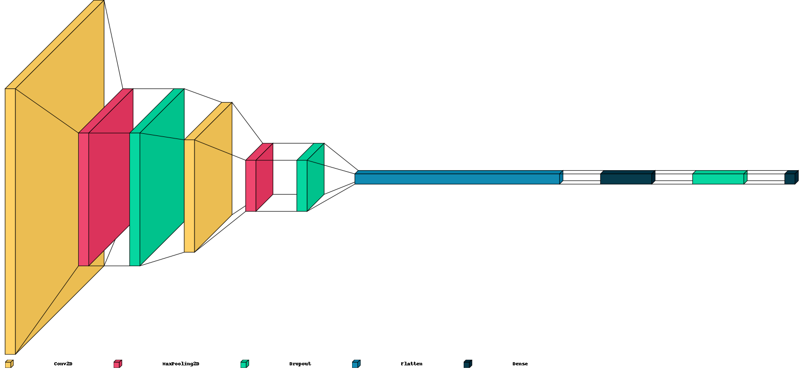

# | CNN | CV | MNIST | Classification
## Convolutional Neural Networks (CNN) with Computer Vision (CV) for MNIST Handwriting Classification

This notebook delves into a classification task involving the use of Convolutional Neural Networks (CNNs) on the famous MNIST dataset, available at [Yann LeCun's website](http://yann.lecun.com/exdb/mnist/).

We have structured the notebook into two main sections:

## Objectives
This section delineates the specific goals of this notebook, which are:

- Training a Deep Neural Network (DNN) model to achieve high accuracy in recognizing handwritten digits.

## Implementation
This section presents the hands-on steps necessary to attain the previously mentioned objectives. These steps include:

1. **Imports, Constants, and Methods:** Setting up the necessary libraries, constants, and methods for our task.
2. **Data Retrieval:** Acquiring the MNIST dataset to be used for training and testing purposes.
3. **Data Preparation:** Preprocessing and setting up the dataset to facilitate effective training of the CNN model.
4. **Model Creation:** Architecting and constructing the CNN model utilizing Keras.
5. **Model Training:** Engaging the CNN model in learning using the prepared dataset.
6. **Evaluation:** Gauging the trained model's performance and analyzing the classification results.

# Project:

- [Github](https://github.com/YanSteph/CNN-MNIST-Simple-Classification-with-Convolutional-Neural-Networks/blob/main/cnn-mnist-simple-classification-with-cnn.ipynb)
- [Kaggle](https://www.kaggle.com/code/yannicksteph/cnn-mnist-simple-classification-with-cnn/)

